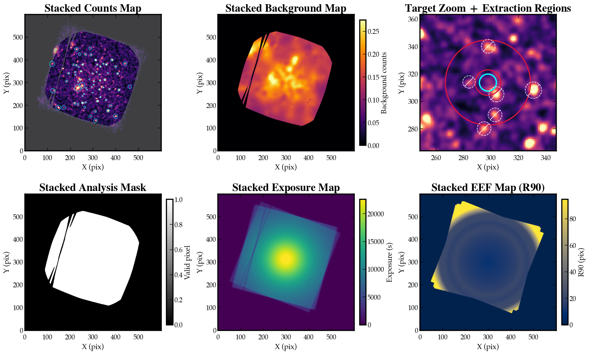

# eFXTDAS

`eFXTDAS` is a small analysis toolkit that extends the official [FXTDAS](https://epfxt.ihep.ac.cn/analysis) workflow for Einstein Probe FXT data.

The official FXTDAS tasks handle the basic event calibration chain. `eFXTDAS` adds the analysis steps that are usually still missing for science work:

- stacked multi-OBSID imaging and spectral combination
- wavelet-style source detection as seeding, followed by PSF fitting + extended source testing
- automated source/background extraction/exclusion-region generation (inspired from [`eSASS` `srctool`](https://erosita.mpe.mpg.de/dr1/eSASS4DR1/eSASS4DR1_tasks/srctool_doc.html) `AUTO` mode) that optimizes SNR and avoid nearby neighbor contamination
- image-sized EEF-radius map generation for PSF-aware workflows

The repository currently provides four user-facing tasks:

- `fxtcombine`: top-level multi-epoch stacking and spectral combination that calls `fxtsrcdet` `fxtregions` `fxteefmap`
- `fxtsrcdet`: source detection and source catalog construction on one image
- `fxtregions`: source/background region generation from a source catalog
- `fxteefmap`: EEF-radius map generation on one image footprint



Example stacked products from `fxtcombine`: smoothed stacked counts, stacked background map, target zoom with source/background extraction regions, stacked analysis mask, stacked exposure map, and stacked EEF-radius map.
- The stacked counts image is labeled with detected sources (out to 75\% EEF radius). 
  - By default the catalog generated with `fxtsrcdet` keeps only sources with detection likelihood over 5 (as per eROSITA simulation, this roughly corresponds to a false detection rate of 25.4\%).
  - Note that we have grayed out the masked region with insufficient exposure near the image edge; sources in those regions are dropped. This is a conservative approach, and is because the EP-FXT vignetting correction is not perfect, so the rate near the edge will be erroneously high and thus leading to many false positives.
- The stacked background map is created after carving out wavelet-detected sources from the image. Per-pixel smoothing is adopted.
- The target zoom-in shows the target region (cyan), background region (crimson), and nearby contamination sources (white) to be carved out. This is created similar to eSASS `srctool`.
- The mask map is defined so that invalid pixels are those with stacked exposure smaller than 30\% of maximum exposure. 
- The EEF map (enclosed energy fraction) actually shows the number of pixels that correspond to 90\% enclosed area of local PSF. Since PSF is poorer off-axis, the value is smallest on-axis, and largest off-axis.


## Installation and Prerequisites

`eFXTDAS` is not a replacement for official FXTDAS. It is a Python-layer extension around that environment.

You should assume:

- official FXTDAS / HEASoft command-line tools are already installed and runnable
- `eFXTDAS` is installed into the same environment
- `CALDB` is available for workflows that need mission calibration

Typical install:

```bash
git clone https://github.com/AstroChensj/eFXTDAS.git
cd eFXTDAS
python -m pip install -e .
```

This installs the Python packages and CLI entry points:

- `fxtcombine`
- `fxtsrcdet`
- `fxtregions`
- `fxteefmap`

## Which Task Should I Use?

| If you want to... | Start with | Main inputs | Main outputs |
| --- | --- | --- | --- |
| combine multiple OBSIDs of the same target | `fxtcombine` | FXT archive tree, target RA/Dec, OBSID list | stacked images, mask, background map, regions, stacked spectrum |
| detect sources on one counts image | `fxtsrcdet` | counts image, optional exposure/mask/eefmap | source catalog, DS9 regions, background map |
| build extraction regions for one target | `fxtregions` | counts image, source catalog, target RA/Dec | `source.reg`, `background.reg` |
| build a per-pixel EEF-radius map | `fxteefmap` | counts image, optional exposure map | EEF FITS bundle such as `R50/R75/R80/R90` |

Recommended rule:

- use `fxtcombine` first for the normal multi-OBSID science workflow
- use `fxtsrcdet` and `fxtregions` directly when tuning detection or extraction on a single stacked image
- use `fxteefmap` directly when you need standalone PSF/EEF support products

## Typical Workflow

For most science use cases, the intended sequence is:

1. Run `fxtcombine` on all OBSIDs of the same target field.
2. Inspect the stacked diagnostics:
   - `stack_cts.fits`
   - `stack_bkgmap.fits`
   - `stack_mask.fits`
   - `stack_src.fits` / `stack_src.reg`
   - `target_src.reg` / `target_bkg.reg`
3. If the stacked source detection or extraction regions need tuning, rerun:
   - `fxtsrcdet` directly on the stacked counts image
   - then `fxtregions` on that updated source catalog
4. Use the final stacked spectra, regions, and response products for downstream spectroscopy.

Important current behavior:

- `fxtcombine` uses energy ranges in keV, not direct PI/channel ranges, for Stage-1 image and light-curve generation.
- `fxtcombine` can optionally process `fsaevt` to generate instrumental-background spectra.
- `fxtcombine` generates `stack_mask.fits` and passes it to `fxtsrcdet`.
- `fxtregions` currently does **not** carve exclusion regions into the source region because complex source-region geometry can confuse `fxtarfgen`.

## Quick Start

### 1. `fxtcombine`

Use this for the full multi-OBSID workflow.

```bash
fxtcombine /data/epfxt \
  --obsid-lst obsids.txt \
  --ra 9.25937 \
  --dec 9.16681 \
  --datatype evt,fsaevt \
  --image-energy-ranges "0.3:10.0,10.0:12.0" \
  --lightcurve-energy-ranges "0.1:12.0,10.0:12.0" \
  --jobs 4 \
  --out-dir combine_out \
  --stack-dir combine_stack
```

Key parameters:

- `--obsid-lst`: comma-separated OBSIDs or a file with one OBSID per line
- `--datatype`: usually `evt`, optionally `evt,fsaevt`
- `--image-energy-ranges`: stacked detection defaults to the first image band
- `--lightcurve-energy-ranges`: whole-field diagnostic light curves
- `--jobs`: Stage-1 OBSID parallelism
- `--stack-dir`: where stacked science products go

See: [docs/fxtcombine.md](docs/fxtcombine.md)

### 2. `fxtsrcdet`

Use this for source detection and background-map generation on one image.

```bash
fxtsrcdet stack_cts.fits \
  --expmap stack_exp.fits \
  --mask stack_mask.fits \
  --eefmap stack_eef.fits \
  --mission ep-fxt \
  --emin 0.3 \
  --emax 10.0 \
  --out sources.fits \
  --regfile sources.reg \
  --save-bkgmap bkgmap.fits
```

Key parameters:

- `image`: counts image
- `--expmap`: exposure map
- `--mask`: global analysis-validity mask
- `--eefmap`: precomputed EEF map bundle, usually from `fxteefmap`
- `--scales`: wavelet scales
- `--background-sigma-grid`: adaptive background smoothing grid
- `--save-bkgmap`: most useful intermediate diagnostic

Python API is available through `fxtsrcdet_pipeline`.

See: [docs/fxtsrcdet.md](docs/fxtsrcdet.md)

### 3. `fxtregions`

Use this after `fxtsrcdet` to build source and background extraction regions for one target.

```bash
fxtregions \
  stack_cts.fits \
  sources.fits \
  --bkgmap bkgmap.fits \
  --ra 9.25937 \
  --dec 9.16681 \
  --mission ep-fxt \
  --emin 0.3 \
  --emax 10.0 \
  --mode auto \
  --src-regfile source.reg \
  --bkg-regfile background.reg
```

Key parameters:

- `image` and `catalog`: stacked image plus `fxtsrcdet` catalog
- `--ra`, `--dec`: target sky position
- `--bkgmap`: recommended for better local background sampling
- `--mode`: `auto` or `manual`
- `--src-radius`, `--bkg-inner`, `--bkg-outer`: used in manual mode

Python users can call `fxtregions.pipeline.build_regions(...)`.

See: [docs/fxtregions.md](docs/fxtregions.md)

### 4. `fxteefmap`

Use this when you need a spatial PSF/EEF support product on one image.

```bash
fxteefmap stack_cts.fits \
  --expmap stack_exp.fits \
  --mission ep-fxt \
  --emin 0.3 \
  --emax 10.0 \
  --out stack_eef.fits
```

Key parameters:

- `image`: image footprint and WCS source
- `--expmap`: zeroes invalid pixels in the output
- `--eeffrac`: request a single map
- `--fractions`: request a multi-extension bundle
- `--optaxis-x`, `--optaxis-y`: optional optical-axis override

Python API is available through `build_eef_radius_map` and `build_eef_radius_maps`.

See: [docs/fxteefmap.md](docs/fxteefmap.md)

## Repo Layout

The most relevant top-level directories are:

| Path | Meaning |
| --- | --- |
| `fxtcombine/` | multi-OBSID stacking workflow |
| `fxtsrcdet/` | source detection and catalog construction |
| `fxtregions/` | source/background region construction |
| `fxteefmap/` | EEF-radius map generation |
| `fxtpsf_helpers/` | mission PSF / EEF support code shared by the tasks |
| `fxtdas-bin/` | local copies of official FXTDAS task scripts for inspection/reference |
| `fxtdas-py/` | local Python support code from the FXTDAS environment |
| `docs/` | detailed package documentation |
| `test*` | sample products, experiments, and debugging outputs |

## Notes for AI Assistants

If a user asks for help with this repo:

- start from `fxtcombine` when the request is about multi-OBSID science products
- start from `fxtsrcdet` when the request is about source counts maps, background maps, or source catalogs
- start from `fxtregions` when the request is about extraction-region geometry
- start from `fxteefmap` when the request is about EEF/PSF radius products

Most useful diagnostics to inspect first:

- `stack_cts.fits`
- `stack_bkgmap.fits`
- `stack_mask.fits`
- `stack_src.fits` / `stack_src.reg`
- `target_src.reg` / `target_bkg.reg`
- `stack_pi.fits`, `stack_bkgpi.fits`, `stack_arf.fits`, `stack_rmf.fits`

Detailed package references:

- [docs/fxtcombine.md](docs/fxtcombine.md)
- [docs/fxtsrcdet.md](docs/fxtsrcdet.md)
- [docs/fxtregions.md](docs/fxtregions.md)
- [docs/fxteefmap.md](docs/fxteefmap.md)
